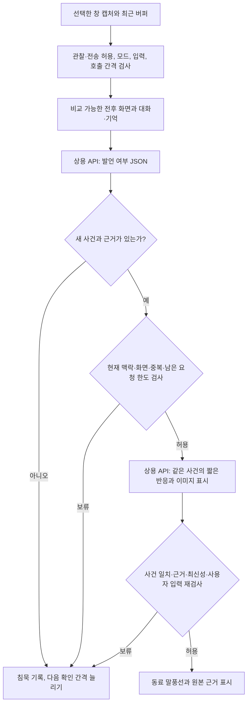

# 상용 API 기반 컴패니언: 논문 분석과 첫 구현

> 2026-10-07. 자체 모델 학습 없이 OpenRouter의 이미지·구조화 출력 API와 앱 로직으로 구성한다. 이 문서는 구현 및 검증 조건이며 성능 개선 실측 보고서가 아니다.

목표는 플레이어와 같은 장면을 보고, 함께 겪은 일을 기억하고, 필요한 순간에 짧게 반응하는 동료다. 게임 안내와 자연스러운 관전 반응을 별도로 평가한다. 논문의 공개 모델을 설치하는 대신 API 밖에서 영상 문맥·기억·발언 타이밍을 제어한다.

## 1. 원문에서 가져온 원칙과 API에서 바꾼 부분

| 원문 근거 | 논문의 실제 방법 | 이번 구현 | 재현하지 않은 부분 |
|---|---|---|---|
| [Proact-VL v4](https://arxiv.org/html/2603.03447v4), §4.2–4.3 | FLAG 토큰의 hidden state를 응답 헤드에 넣고 임계값으로 발화/침묵 결정, 발화할 때 짧은 문장 생성 | 작은 JSON 판단 요청 → 로컬 정책 검사 → 필요할 때 대사 요청 | 내부 표현·학습된 응답 헤드·확률 임계값·학습 손실. API 판단은 학습된 헤드와 성능·비용이 같지 않음 |
| 같은 원문, §5.2, Appendix C | 게임 안내·단독 해설·공동 해설과 내용·타이밍을 따로 평가 | 질문 응답과 자발적 반응의 평가를 분리. 사건·근거·표시 여부를 기록 | 연구의 전용 모델 점수나 GPU 지연을 앱 성능으로 사용하지 않음 |
| [StreamChat / Xiong 외 v1](https://arxiv.org/html/2501.13468v1), §3.1 | 단기 시각 기억·장기 기억·대화 기억을 분리하고 질문 관련 기록 검색 | 최근 장면, SQLite의 관련 기록/원본 이미지, 최근 대화를 구분하고 문자 상한 적용 | 시각 특징의 클러스터링·계층 트리·영상 토큰 압축. 현재는 기존 전문 검색과 기록 선별 |
| 같은 원문, §3.2 | 선택적 프레임 처리·기억 갱신·요청 처리를 별도 스레드로 실행 | API 대기 중 캡처 계속. 요청 시작 시점의 문맥과 근거를 고정하고 완료 시 맥락·최신성을 재검사 | 논문의 3개 GPU/모델 처리 스레드를 재현한 것은 아님 |
| 같은 원문, Appendix E | 잘못된 과거 답변을 검색하면 다음 답변도 틀릴 수 있음 | 사용자 발화와 AI 답변의 출처 구분, 정정·삭제 시 파생 답변 무효화, 만료 이미지 재전송 제외 | 장기 기억의 완전한 정확성이나 모든 게임의 개체 식별은 미검증 |

Proact-VL의 GPT-4o/Gemini 게임 비교는 오프라인 출력에 대한 평가다. StreamBench의 GPT-4o/mini 결과도 우리 앱의 API 지연을 제공하지 않는다. 일반 상용 API에서 hidden state, 전용 모델 KV 캐시, 추가 학습된 응답 헤드를 사용할 수 있다고 가정하지 않는다.

## 2. 자동 반응의 처리 흐름



- **판단 단계:** `should_speak`, `reason`, `event_type`, `event_key`, `focus_busy`, `goal_related`, `facts`, `observed_change`만 요청한다. 대사를 만들지 않는다. 출력 상한은 800토큰이며 실제 토큰 수는 제공자 사용량으로 기록한다.
- **침묵:** 모호한 변화·중복·집중 상황이면 답변 생성 요청을 생략한다. 판단 요청 자체는 유료 호출 한 번이다.
- **발언 단계:** 판단한 사건의 종류·키·전후 근거·관찰 내용을 그대로 유지하며 1~2문장으로 표현한다. 원본과 모순되면 침묵할 수 있다. 다른 사건으로 바뀌면 표시하지 않는다.
- **로컬 제어:** 모델의 발언 판단은 후보다. 기존 입력·집중·중복·거절·빈도·세션·관찰 공백·장면 변경·사건 나이 검사를 대체하지 않는다. 판단 후와 대사 도착 후에 다시 검사한다.
- **사용량:** 한 번의 자동 확인은 침묵이면 API 요청 1회, 대사 생성까지 진행하면 2회다. 각 단계 직전에 일일 한도를 확인하고 각각 원장에 남긴다. 같은 분석의 단계들은 공통 `sessionId`로 묶는다. 남은 한도가 1회이면 판단만 하고 대사를 생성하지 않는다.
- **취소:** 전체 분석의 60초 타임아웃과 월드·설정 변경 시 취소를 두 단계에 공유한다. 단계 실패나 취소를 자동 재전송하지 않는다. 전송한 요청의 비용을 없앤다고 보장하지 않는다.
- **직접 질문:** 판단 요청을 거치지 않고 응답 요청 한 번을 보낸다. 잡담에는 게임 변화나 이미지가 필수가 아니다.

판단과 발언은 현재 사용자가 선택한 **같은 모델**을 쓴다. 저렴한 별도 판단 모델의 자동 선택은 구현하지 않았다. 제공자별 별도 판단 모델은 품질·비용을 비교한 뒤 설정과 연결 테스트를 함께 설계한다.

후속으로 [Jev와 상용 LLM의 정책 비교](JUDGE_MODEL_COMPARISON.md)를 준비했다. Jev는 텍스트와 별도 Decisions API를 사용하므로 기존 비전 판단 요청 전체의 대체품이 아니다. 비교 도구는 같은 관찰 텍스트에서 발언 여부만 평가하며 실제 앱의 모델 설정을 바꾸지 않는다.

## 3. 화면과 기억의 구성

| 계층 | 입력과 상한 | 처리 |
|---|---|---|
| 최근 장면 | 초당 1회 캡처, 기존 최근 60장 임시 버퍼. 직접 질문에는 최근 30초에서 최대 3장 | 같은 월드·창·세션·관찰 연속성·크기만 선택. 최신 장면에서 거슬러 올라가 최소 10초 간격, 정확히 같은 이미지 바이트는 제외 |
| 자동 비교 | 기존 15~45초 간격의 전후 화면 2장 | 비교 대상의 시간·ID와 양쪽 사실 필요. 픽셀 변화 자체를 의미 있는 게임 사건으로 확정하지 않음 |
| 장기 기록 | 월드별 검색된 사용자 기억·목표·결정·경험·과거 답변, 최대 18개 후보와 12,000자 상한 | 기록 전체를 선별. 결과의 조건·정정·불확실성이 사라질 수 있어 중간을 잘라 요약하지 않음 |
| 대화 기억 | 최근 최대 12턴과 6,000자 상한 | 최신 완전한 턴을 우선. 전달되지 않은 자동 후보는 제외 |
| 회상 이미지 | 검색된 경험뿐 아니라 과거 답변이 참조한 원본도 선택 | 직접 질문의 최근 장면과 합쳐 최대 4장. 최신/최근/회상 역할과 관찰 시점을 전달. 지정 이미지 질문은 그 한 장만 전달 |

문자 상한은 로컬 선별 기준이다. 전체 요청의 토큰·이미지 비용 상한을 뜻하지 않는다. 제공자의 실제 입력·출력 토큰과 보고 비용을 따로 기록한다. 문맥에서 제외한 기록 수는 `context_budget`에 전달하고, 실제로 보낸 기억·대화 ID만 파생 답변의 의존성에 연결한다.

최근 창 장면이 없으면 기존 저장 기록을 사용할 수 있으며 이를 현재 화면이라고 표시하지 않는다. 리플레이 질문에서는 최신 영상 프레임을 저장하되 기록의 `video_time`과 출처를 유지한다. `current` 역할은 요청의 기준 장면이며 API 응답 시점의 실시간 상태를 보증하지 않는다.

회상 이미지는 해당 월드의 저장소에서 다시 조회한다. 다른 월드의 이미지, 삭제·만료된 원본은 전송하지 않는다. 원본이 만료돼도 사용자 결정·경험 기록을 자동으로 확정하거나 없애지 않는다. 한 번의 성공을 게임의 보편 규칙으로 승격하지 않는다.

## 4. 비용·지연의 판단

두 단계가 항상 더 빠르거나 저렴한 것은 아니다. 발언이 생기면 같은 이미지와 문맥을 다시 보내며 판단 지연과 대사 지연이 더해진다. 현재처럼 하나의 강한 모델을 쓰면 판단 요청도 비쌀 수 있다.

확인 횟수를 `N`, 발언 생성 비율을 `p`, 판단과 대사 요청의 평균 비용을 `C_gate`, `C_reply`로 두면 비교의 출발점은 다음과 같다. 실제 값은 입력 크기와 제공자 청구로 측정한다.

- 한 단계: 약 `N × C_reply`.
- 두 단계: 약 `N × C_gate + p × N × C_reply`.
- 두 단계의 비용 이점은 대략 `C_gate < (1-p) × C_reply`일 때 생긴다. 추가 호출·이미지 입력 비용도 포함해야 한다.

침묵 구간의 긴 출력 생성을 줄이고 정책 판단을 기록할 수 있는 구조를 먼저 마련했다. 빠른 사건을 놓치는 문제, 작은 UI 판독, 의미 수준의 최신 상태 재검증과 현재 게임 좌표 정렬은 이번 변경으로 해결됐다고 주장하지 않는다.

## 5. 실제 상용 API 비교 방법

평가 입력 예시는 [API_BENCHMARK.example.json](cases/API_BENCHMARK.example.json)이다. **경로·시점·기억은 작성 형식의 예시다. 실제 평가 영상에서 추출한 JPEG와 그 시점의 기록으로 바꿔야 한다.** 제공된 예시 파일에는 실제 게임 이미지가 포함되어 있지 않다. 영상의 `at/captured_at`은 평가용 시간축이고 `video_time`은 영상 시각이다. 실제 게임의 현재 상태로 사용하지 않는다.

호출 없이 비교 계획과 누락 이미지를 확인한다.

```powershell
npm run benchmark -- --manifest docs/cases/API_BENCHMARK.example.json
```

이미지와 기록을 준비하고 앱을 닫은 뒤, 기존 OS 암호화 키·선택 모델·전송 동의·일일 한도로 실행한다. 키를 JSON이나 명령에 넣지 않는다.

```powershell
npm run evaluate -- --live --companion .local/bench/suite.json
```

| 대상 | 비교 조건 | 목적 |
|---|---|---|
| 직접 질문 | `current`: 기준 화면만 | 현재 이미지로 답할 수 있는 범위 |
| 같은 직접 질문 | `recent`: 동일 사례의 여러 화면과 최근 대화 | 최근 흐름이 원인·상황 이해에 도움이 되는가 |
| 같은 직접 질문 | `memory`: 위 입력과 그 시점까지의 관련 기억 | 과거 결정·시도의 회수가 정확한가 |
| 자동 반응 | `single`: 기존 한 단계 출력 | 발언과 침묵을 함께 요청하는 기준 |
| 같은 자동 반응 | `gated`: 판단 후 필요할 때 생성 | 불필요한 발언, 추가 호출과 전체 지연의 차이 |

자동 반응 비교의 두 조건은 같은 화면·대화·기억을 쓴다. `together`에는 시간순 전후 화면 두 장이 필요하다. 미래 이미지·다른 월드·미래 기억/대화는 기록 시각과 수정·경험 이력의 시각을 검사해 거절한다. 시각이 없는 내용이 당시 알려진 사실인지도 사람이 확인해야 한다. 사람이 작성한 `expected`는 보고서에만 남기고 모델에 전송하지 않는다.

한 질문은 최대 3회, 자동 사례는 최대 3회 요청한다. 예시 두 사례의 최대 요청 수는 6회다. 침묵이면 줄어들며 연결 테스트와 다른 앱 요청도 동일 일일 한도를 사용한다. 한도·실패·시간 초과로 중지하면 부분 결과와 중지 이유를 남긴다.

결과는 `.local/companion-evaluation-*.json`에 저장한다. 모델 응답의 실제 모델 ID, 제공자 요청 ID, 단계별 토큰·보고 비용·입력 규모·응답 시간·판단·답변을 남긴다. `headersMs`는 응답 헤더 도착, `totalMs`는 응답 본문 수신과 검증 완료까지이며 **첫 토큰 지연은 아니다.** 키와 인증 헤더는 저장하지 않는다.

사람은 화면 사실·수치 환각·회상 정확도·침묵 적절성·말투·이미지 표시를 평가한다. `humanReview`는 평가 전 `null`이다. 이 도구는 오프라인 내용·판단 비교이며 실제 창의 신선도·게임 포커스·사용자가 집중하는 순간의 방해 정도를 시험하지 않는다. 요청당 비용을 지속 관찰의 시간당 비용으로 환산하지 않는다.

현재 입력 비교는 작성된 관련 기억을 사용한다. 실제 장기 검색의 성공률과 세션 간 기억은 앱에서 별도로 검증한다. 비용·지연은 반복 실행의 분포로 보고하고, 품질 판정은 평가자에게 모델/조건 이름을 가린 비교로 보완한다.

## 6. 구현 파일과 이번 검증

- `src/proactivity.cjs`: 판단 검증·침묵·두 단계 흐름·사건 일치.
- `src/api-session.cjs`: 단계별 요청 예약·한도·취소·사용량/지연 기록.
- `src/stream-context.cjs`: 최근 장면 선택과 완전한 기록/대화의 문자 상한.
- `src/provider.cjs`, `src/prompts.cjs`: 판단/대사별 스키마와 프롬프트, 입력 역할·시점·문맥 통계.
- `src/store.cjs`, `src/main.cjs`: 관련 원본 이미지 검색, 캡처·로컬 정책·저장과 연결.
- `scripts/companion-evaluation.cjs`: 시간순 사례 검증·입력 비교·한/두 단계 비교. 기존 Electron 평가 진입점이 저장된 키와 동의를 제공한다.
- `test/api-companion.cjs`: 실제 SQLite와 모의 API로 침묵의 1회 호출, 발언의 2회 호출, 단계별 한도·취소·다른 사건 보류·문맥 상한·회상 이미지·미래 자료 거절·정답 미전송 확인.

이번 클라우드에서 `node test/check.cjs`와 평가 계획 출력이 통과했다. 테스트의 응답·이미지 바이트는 모의 자료다. 새 판단 스키마와 두 단계 요청을 실제 상용 모델에 호출한 결과, Windows/Electron의 새 실행 흐름, 실제 장시간 게임의 품질은 아직 검증하지 않았다. 기존 [가이드 평가 9회](GUIDE_EVALUATION.md)는 이전 구현의 실제 측정이며 이번 구조의 개선 수치로 사용하지 않는다.
